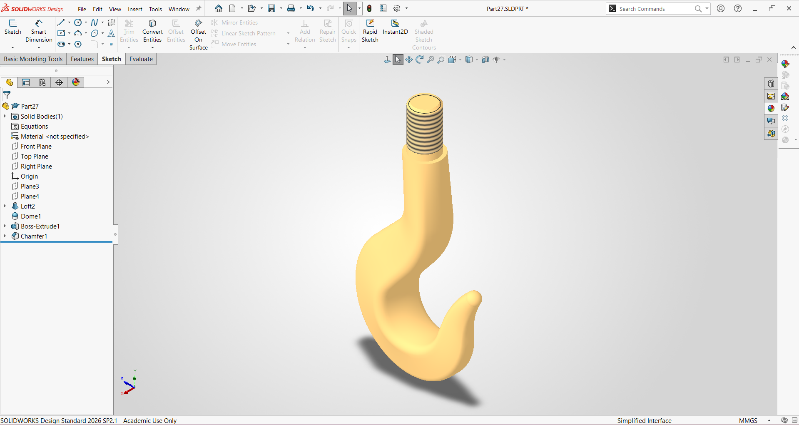

# Crane Hook Design using SolidWorks

## Overview
🔩 Excited to share my latest 3D CAD design — a Crane Hook modeled in SolidWorks!
This part was built using a combination of advanced modeling techniques:
✅ Loft feature – for the smooth, curved hook body
✅ Dome feature – for the rounded tip geometry
✅ Boss-Extrude – for the shank/stem section
✅ Chamfer – for clean edge transitions at the threaded area
✅ Helix/Thread – for the bolt thread on top
Crane hooks are critical lifting components used in construction, manufacturing, and heavy industries. Designing them accurately in CAD ensures proper load analysis and safety validation before fabrication.
This was modeled as part of my CAD practice journey using SolidWorks Design 2026 SP2.1.
💡 Always excited to push my skills further in mechanical design and product development!
#SolidWorks #CAD #MechanicalDesign #3DModeling #ProductDesign #Engineering #CraneHook #ManufacturingEngineering #LearnCAD #MechanicalEngineering.

## Software Used
- SolidWorks 2026

## Features
- Smooth hook geometry
- Threaded upper shaft
- Chamfer finishing
- Parametric 3D modeling

## Preview

## Files Included
- CraneHook.SLDPRT
- CraneHook.STEP

## Author
Rupesh Chandrahas Mahale
Mechanical Design Engineer
